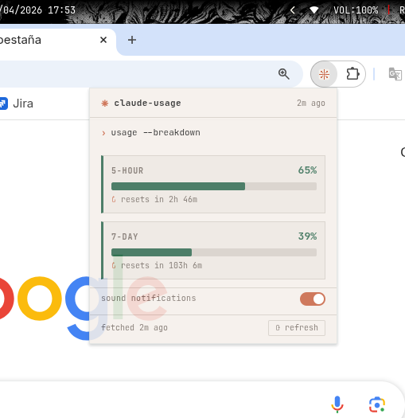
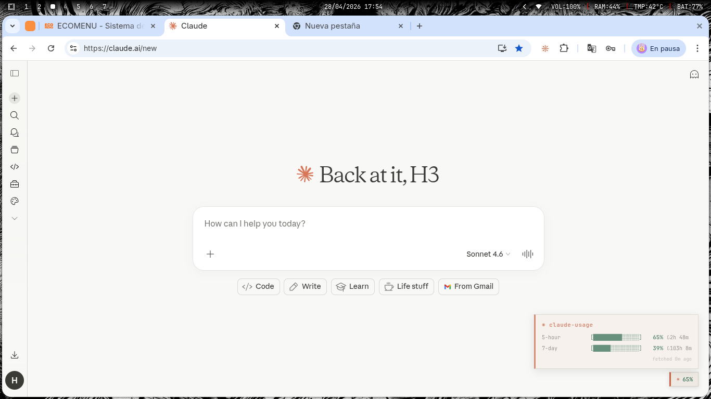

# Usage Monitor

Una extensión chiquita para ver tu usage de Claude y OpenCode Go sin dejar lo que estás haciendo.

Mientras trabajás o navegás, la extensión revisa en silencio el uso cada cinco minutos y guarda todo en `chrome.storage`.

## Screenshots

## Cómo probarla
1. Abrí `chrome://extensions` (o `edge://extensions`).
2. Activa el modo desarrollador.
3. Cargá esta carpeta como **extensión desempaquetada**.

## Qué te da
- Estado de Claude / Claude Code (sesión de 5 horas y límite semanal).
- Estado de OpenCode Go (límites de 5 horas, semanal y mensual, tal como los expone la API oficial).
- Popup y overlay con barras unificadas, porcentaje usado y countdown de reset.
- Claude usa las cookies de tu sesión.
- OpenCode Go usa su API key contra el endpoint oficial `https://opencode.ai/zen/go/v1/usage` (no acepta la cookie web de opencode.ai). Dos formas de conectarlo:
  - Pegá la key en **Settings** (se guarda en `chrome.storage.local`).
  - O corré `python3 daemon.py`: lee la key automáticamente de `~/.local/share/opencode/auth.json` y la extensión la descubre sola en `http://localhost:19876/usage`.

El daemon es solo un proxy hacia la API oficial: el uso en dólares lo calcula el servidor de OpenCode, así que no hay estimaciones locales. Si la API no responde, verás el error en el popup en vez de números inventados.

Si la info no actualiza, revisá `background.js`: ahí están las URLs y la normalización de cada fuente. La key de OpenCode se guarda en `chrome.storage.local` y solo se envía al endpoint oficial de usage.
